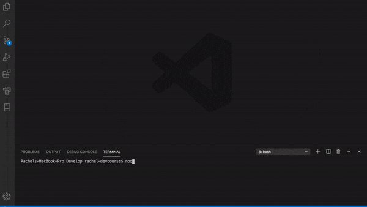

# team-profile-generator
Team Profile Generator app for hw assignment 10



## Instructions
Use this command-line application to generate a browser-friendly html file in order to view and organize your team members. The app will ask you to enter each employee's information based on the role you select. When prompted, enter y to continue entering new employees and when finished, enter n to allow the app to generate your file. 

```
As a manager
I want to generate a webpage that displays my team's basic info
so that I have quick access to emails and GitHub profiles
```

### User input
The project must prompt the user to build an engineering team. An engineering
team consists of a manager, and any number of engineers and interns.

© 2019 Rachel Humble